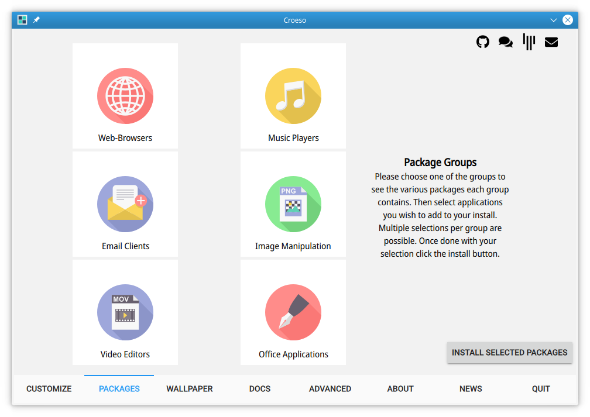

# Croeso
First run settings and info app for KaOS, written in QML





### License
GPL

Flaticons made by <a href="https://www.flaticon.com/authors/icon-monk" title="Icon Monk">Icon Monk</a> from <a href="https://www.flaticon.com/" title="Flaticon"> www.flaticon.com</a>

### Dependencies

qt5-quickcontrols2, qt5-webview, plasma-framework


### Installation
Go to the source directory of the project and run:

```
/usr/lib/qt5/bin/qmake croeso.pro
make
make install
```

Make sure to adjust to the correct path of your Qt5 qmake. This will build and install Croeso, including localizations files.
